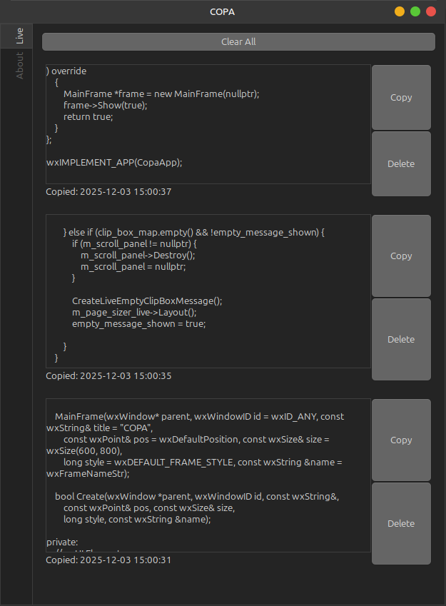

# COPA *(COPA Offline Paste Attic)*
# <br>
A cross-platform GUI application to log clipboard history, made using [wxWidgets](https://wxwidgets.org/) (tested on Linux Mint 22 LTS).

## Building
Requirements:<br>
- A C++ compiler (here I use GCC),
- [wxWidgets development libraries](https://wxwidgets.org/downloads/).

Procedure:<br>
1. Pull the repository.<br>
2. Create a `build` folder on the root directory of this repository.
3. Compile the code with `wx-config --cxxflags --libs` flag. Using GCC:
```
g++ -o build/copa_app src/core.cpp src/main.cpp `wx-config --cxxflags --libs`
```
4. To run the application, simply execute the built binary:
```
build/copa_app
```

## Screenshot
<br>
(on Linux Mint 22, theme: [WhiteSur-Dark-solid](https://cinnamon-spices.linuxmint.com/themes/view/WhiteSur-Dark-solid))
